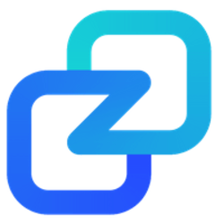
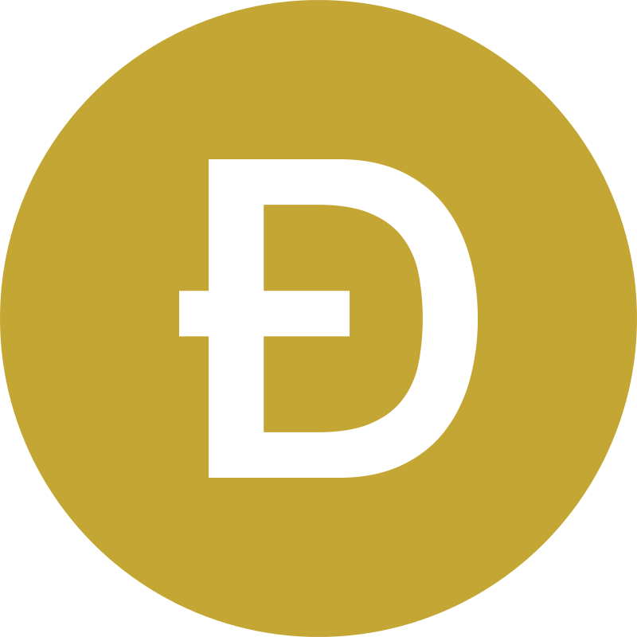
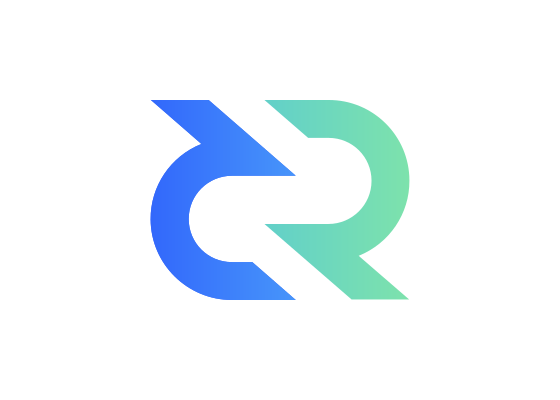

<!-- links for markdown -->

[Discord]: https://discord.awfixer.com
[AWFixer]: https://theautist.me
[Friends]: https://awfixer.com
[Site]: https://modded-android.dev
[guns]: https://guns.lol/fixer
[Paper]: https://paper.modded-android.dev
[Goals Paper]: https://paper.modded-android.dev/paper
[Github Repos]: https://github.com/orgs/modded-android/repositories

[Lineage]: https://lineageos.org
[Graphene]: https://grapheneos.org
[librephone]: https://www.fsf.org/campaigns/librephone
[Android 14]: http://android.com/android-14/

[Google]: https://about.google/

[Java]: https://www.java.com/
[Rust]: https://rust-lang.org/
[Nim]: https://nim-lang.org/
[Zig]: https://ziglang.org/
[Kotlin]: https://kotlinlang.org/
[c]: https://en.wikipedia.org/wiki/C_(programming_language)
[v]: https://vlang.io
[carbon]: https://carbon-lang.dev
[go]: https://go.dev
[cpp]: https://cpp-lang.net

<!-- hero section -->

<h1 align="center"><a href="https://modded-android.dev"> Modded Android </a></h1>

 Lets make AOSP Open and Complete (and secure) again 

 join the <a href="https://inv.wtf/moddedandroid"> Discord </a>

> [!CAUTION]
> README is a WIP

<!-- info section -->

<h2 align="center"> What is Modded Android? </h2>

<!--
<h3>Visit our <a href="https://discord.gg/ajsbasement">Careers Site</a> to check out if you can help out</h3>
-->

## AWFixer and Friends CTA:

This Project is necessary since toxic elements within OSS projects, moles from BigTech, are boycotting any substantial work, in order to destroy the "projects", to eliminate competition of their own products. Classic "embrace, extend, extinguish" tactics.

This is an independent project, not at all affiliated with BigTech or any of their subsidiaries or tax evasion tools, nor any political activists groups, state actors, etc. It's explicitly free of any "DEI" or similar discriminatory policies. Anybody who's treating others nicely is welcomed.

It doesn't matter which country you're coming from, your political views, your race, your sex, your age, your food menu, whether you wear boots or heels, whether you're furry or fairy, Conan or McKay, comic character, a small furry creature from Alpha Centauri, or just a boring average person. Anybody who's interested in bringing AWFixers Stuff forward is welcome.

Together we'll make FOSS great again!

> [!NOTE]
> Modded Android is not like [Librephone]. They are generally targetting the ecosystem of platforms that Android serves, we are being extremely surgical about what we are building

this part has been slimmed down a lot and moved to the [Paper] site

one thing that you have to think about when you are making a project, is how do you make a project that will both solve a problem, or series of problems, and also be recieved well by the community. The main way that you do that is you work on a problem that has been previously solved, though for one reason or another that solution has been abandoned, broken, or otherwise corrupted. That is what modded Android is.

We will be taking the codebase for [Android 14], removing anything and everything [Google] related, and also stripping out the various Arch parts, as we will no longer be providing broad device support. We will then be working on completely porting and rewriting the codebase in modern, safe languages, as detailed on the [Paper] site and in the goals section below.

be sure to check out the [Discord], the [Github Repos], and see what you think. We are always open to hearing from you on the Discord.

<h2 align="center"> Why Now? </h2>

[Google] is no longer dealing with Android in good faith in my opinion, and in order to fight back we forked the 14th generation of android to create Modded Android. It is a thing we have wanted to do for a while, and we have seen a lot of Android based operating systems out there like [Lineage] and [Graphene]. Modded Android is different then them as it is a full fork with full intentions to fully rewrite it, and create it's own competing ecosystem.

<h2 align="center"> Money? </h2>

hi, im austin - the founder/creator/dev/filltheblank for Modded Android at the time of writing. If you wanna gimme money, i am not going to stop you, this project will get expensive fast. you can visit my [guns] biolink and use one of the links there, cashapp/kofi/patreon, even cryptocurrency if that is your jam

<table align="center" style="border-collapse: collapse; margin: 0 auto;">
  <tr>
    <td align="center" style="padding: 10px;">
      
    </td>
    <td align="center" style="padding: 10px;">
      
    </td>
    <td align="center" style="padding: 10px;">
      
    </td>
    <td align="center" style="padding: 10px;">
      
    </td>
  </tr>
</table>

<table>
  <tr>
    <td style="text-align: center; padding: 10px;">
      
       
      Bitcoin (BTC)
       
      <code>sp1qq0vfvm84j5a4h62qwhmgktu9pec8zk5nv6yaxy6jemar74ty05ff6q40gt9v47c3dtmrxszumh3633d9ap86rf9rd2w5m2n7kju5w0ccxcz2xxst</code>
    </td>
    <td style="text-align: center; padding: 10px;">
      
       
      Ethereum (ETH)
       
      <code>0x1Aeb1b886B0f4c082b78ec006B9a2824Ad23EF03</code>
    </td>
    <td style="text-align: center; padding: 10px;">
      
       
      Zano
       
      <code>ZxCNiXke6CWXngcVd8A5GaUAcHMEiMjRe8GQEovpTZSaeUmsUwaebKhDuvpWg6GFFVTf7rH8UF9v8HH5GFyRgJ2Q1KRzjBTnK</code>
    </td>
    <td style="text-align: center; padding: 10px;">
      
       
      Dogecoin (DOGE)
       
      <code>DAaNJBFh96A4G5ZrV9idHPMFfp9JVRrrVH</code>
    </td>
    <td style="text-align: center; padding: 10px;">
      
       
      Solana (SOL)
       
      <code>51LsPshM96deVbf8sbkfmsgHC3k3sRLDw4Zz2mNsGFi7</code>
    </td>
    <td style="text-align: center; padding: 10px;">
      
       
      Decred
       
      <code>DsVgp7HyF54qpmHTYv93ZhjAjxAoS8qucvN</code>
    </td>
  </tr>
</table>

<h2 align="center"> Goals? </h2>

yes, we have a series of goals

we want to target a single platform for MA, at least in the beginning. this will allow us to create optimizations that we otherwise would be unable to work on.

we also plan on migrating all legacy code ([Java]/[kotlin]/[c]/[cpp]) to modern equivilents like [rust]/[zig]/[nim]/[v], with things like [go]/[carbon] used where needed.

we also plan on having no security bugs and the slimist codebase for this type of project.

for more goal info see the [Goals Paper]

<!-- we are watching you -->

made with ❤️ by [AWFixer] and [Friends] ©️ 2025 All Rights Reserved

